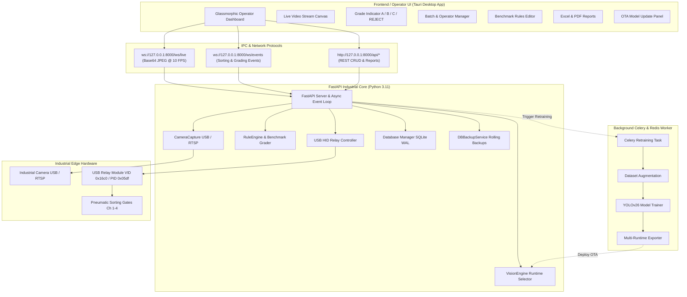

# Automated Durian Classification System — Architecture Design

This document details the system design, hardware integrations, machine learning runtime architecture, and API messaging protocols for the **Automated Durian Defect Detection and Quality Classification System**.

---

## 1. System Overview

The system uses a **split-process architecture** designed to achieve deterministic real-time computer vision inference (10–30 FPS) while maintaining a lightweight, memory-efficient, and responsive operator user interface on industrial edge hardware.



---

## 2. Component Details

### 2.1 Vision Engine & Multi-Runtime Execution
The `VisionEngine` detects the underlying hardware architecture and automatically selects the highest-performance inference backend without requiring code changes:

| Target Platform | Runtime Backend | Model Artifact | Hardware Target | Latency Target |
|---|---|---|---|---|
| **Apple Silicon (macOS ARM64)** | CoreML Runtime | `models/yolov26n_v1/coreml/best.mlpackage` | Apple Neural Engine (ANE) / GPU | `< 100 ms` |
| **Intel / AMD (Windows / Linux x86)** | OpenVINO Runtime | `models/yolov26n_v1/openvino/best.xml` | Intel AVX-512 / Iris GPU | `< 200 ms` |
| **Universal Fallback** | ONNX Runtime | `models/yolov26n_v1/best.onnx` | CPU / Generic GPU | `< 250 ms` |
| **Research / Training** | PyTorch Runtime | `best.pt` | CUDA / MPS / CPU | N/A |

#### Defect Classes Detected
1. `crack` (Orange bounding box) — Fruit shell fracture or split.
2. `dark_spot` (Brown bounding box) — Sunburn, mechanical bruise, or superficial necrosis.
3. `fungus` (Yellow bounding box) — Fungal mycelium contamination (*Phytophthora palmivora*).
4. `thorn_split` (Amber bounding box) — Punctured or broken thorns.
5. `reject` (Red bounding box) — Severe malformation, rot, or undersized fruit.

---

### 2.2 Rule Engine & Decoupled Benchmark Profiles
The `RuleEngine` separates computer vision bounding box detection from business grading logic. Rather than baking grade criteria into the neural network, bounding box parameters are evaluated against active **Benchmark Profiles** (`config/benchmarks/*.json`):

- **Per-Defect Rule Checks**:
  - `max_count_A`, `max_count_B`, `max_count_C`: Maximum permissible defect instances per grade.
  - `max_area_ratio`: Max percentage of the fruit's surface area covered by a defect.
  - `force_reject`: If `true`, any detection of this defect immediately forces a `REJECT` grade (e.g. `fungus`).
- **Global Rules**:
  - `max_total_defects_A`, `max_total_defects_B`, `max_total_defects_C`.
  - `max_total_area_ratio_A`, `max_total_area_ratio_B`, `max_total_area_ratio_C`.
- **Dynamic Hot-Reloading**: Changes saved to JSON profiles are applied instantaneously at runtime without restarting the application.

---

### 2.3 USB HID Relay Controller & Sorting Gate Actuation
The `RelayController` interfaces with a standard 4-channel USB HID Relay module (Vendor ID: `0x16c0`, Product ID: `0x05df`):

```
Channel 1 ──> Pneumatic Gate A (Export Grade A)
Channel 2 ──> Pneumatic Gate B (Grade B)
Channel 3 ──> Pneumatic Gate C (Grade C)
Channel 4 ──> Reject Trapdoor (Reject / Quarantine)
```

- When running without physical hardware (or on dev machines), setting `"relay_mock": true` in `config/app.json` enables console emulation mode with zero errors.

---

### 2.4 Data Persistence & Backup Architecture
- **Database Engine**: Embedded SQLite at `data/durian.db`.
- **Write-Ahead Logging (WAL)**: Initialized with `PRAGMA journal_mode=WAL` and `PRAGMA synchronous=NORMAL` to enable high-throughput non-blocking reads during continuous sorting.
- **Automated Backup Service (`DBBackupService`)**:
  - Runs in a dedicated background thread.
  - Generates timestamped database snapshots to `data/backups/durian_backup_YYYYMMDD_HHMMSS.db` every 15 minutes.
  - Maintains a rolling window of the last 10 backups.
- **Reporting Services**:
  - **Excel**: Generates styled `.xlsx` reports via `openpyxl` with defect breakdowns, batch averages, and visual grade summaries.
  - **PDF**: Generates publication-ready `.pdf` reports via `reportlab` with charts and inspection timestamps.

---

### 2.5 Asynchronous Model Retraining & OTA Hot-Swap Pipeline
When operators collect new misclassified images in the packing facility:
1. Retraining is triggered via Celery (`tasks/retrain.py`).
2. `core/augment.py` creates a 10x augmented dataset with industrial augmentations (motion blur, lighting variations).
3. YOLO model trains for configured epochs, tracking loss in MLflow.
4. Model is exported to CoreML, OpenVINO, and ONNX formats in a temporary staging directory (`models/pending_model/`).
5. Benchmark validation runs against industrial KPI gates.
6. A pending update notification (`config/pending_model.json`) is pushed to the UI.
7. Operator inspects old vs new KPIs on the **Settings** panel:
   - **Approve**: Staged weights overwrite active `models/yolov26n_v1` directory without restarting the server.
   - **Reject**: Staging directory and pending notification are discarded.

---

## 3. Communication Protocols

### 3.1 Live Camera Feed WebSocket
- **Endpoint**: `ws://127.0.0.1:8000/ws/live`
- **Direction**: Server $\rightarrow$ Client
- **Payload**: Raw Base64 string of the JPEG-encoded annotated video frame at 10 FPS.

### 3.2 Event Notification WebSocket
- **Endpoint**: `ws://127.0.0.1:8000/ws/events`
- **Direction**: Server $\rightarrow$ Client
- **Payload Schema**:
  ```json
  {
    "event_type": "detection",
    "batch_id": "BATCH_20260525_001",
    "grade": "B",
    "reasons": [
      "dark_spot count (1) exceeded limits for Grade A"
    ],
    "detections": [
      {
        "class": "dark_spot",
        "bbox": [120, 150, 45, 30],
        "confidence": 0.84
      }
    ],
    "timestamp": "2026-05-25 18:11:45"
  }
  ```

### 3.3 Core REST APIs
| Method | Route | Description |
|---|---|---|
| `GET` | `/health` | Server health, model version, DB size, and active batch state |
| `POST` | `/api/batch/start` | Start a sorting batch session |
| `POST` | `/api/batch/stop` | Stop active sorting batch |
| `GET` | `/api/batch/{batch_id}` | Retrieve comprehensive summary for a batch |
| `GET` | `/api/detections` | Query paginated sorting detection history |
| `GET` | `/api/config/benchmarks` | List all available benchmark JSON profiles |
| `GET` | `/api/config/benchmarks/{name}` | Read specific benchmark profile rules |
| `POST` | `/api/config/benchmarks/{name}` | Create or update benchmark profile |
| `DELETE`| `/api/config/benchmarks/{name}` | Remove benchmark profile |
| `GET` | `/api/config/rules` | Get active rules and confidence thresholds |
| `POST` | `/api/config/rules` | Update active benchmark and defect thresholds |
| `GET` | `/api/config/camera` | Get camera capture parameters |
| `POST` | `/api/config/camera` | Update camera capture parameters |
| `GET` | `/api/model/update` | Check for pending OTA model updates |
| `POST` | `/api/model/update/approve` | Deploy pending retrained model weights |
| `POST` | `/api/model/update/reject` | Dismiss pending retrained model |
| `GET` | `/api/reports/{batch_id}/excel`| Generate and download Excel `.xlsx` report |
| `GET` | `/api/reports/{batch_id}/pdf` | Generate and download PDF `.pdf` report |
