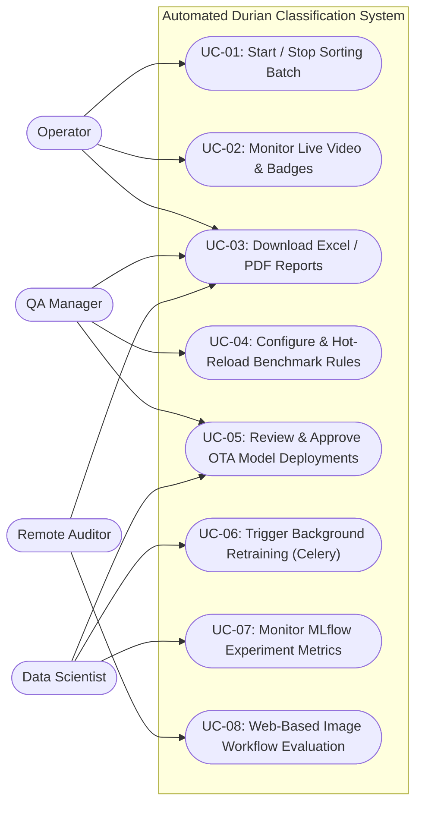
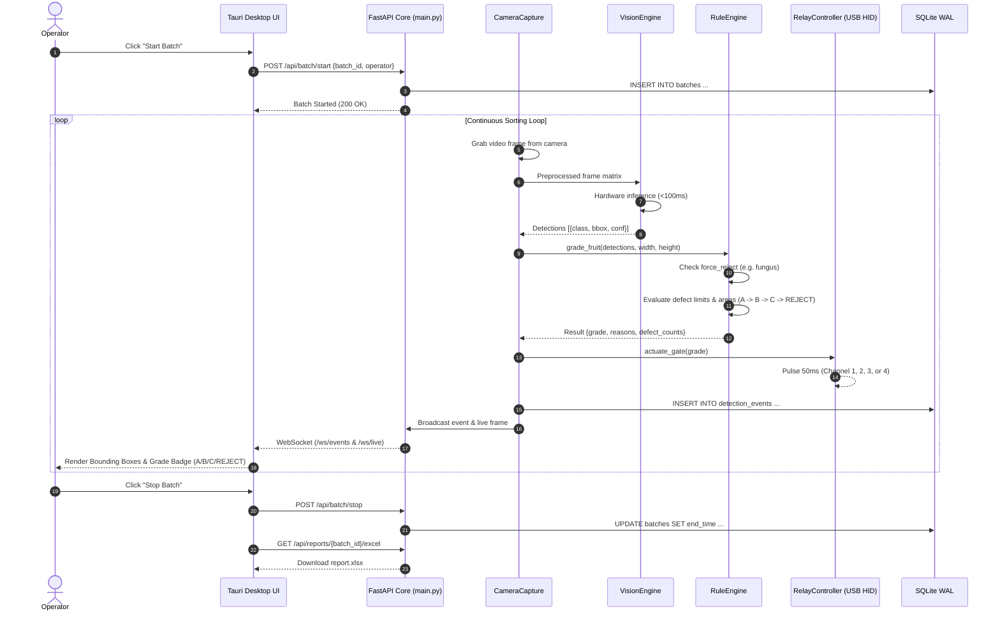
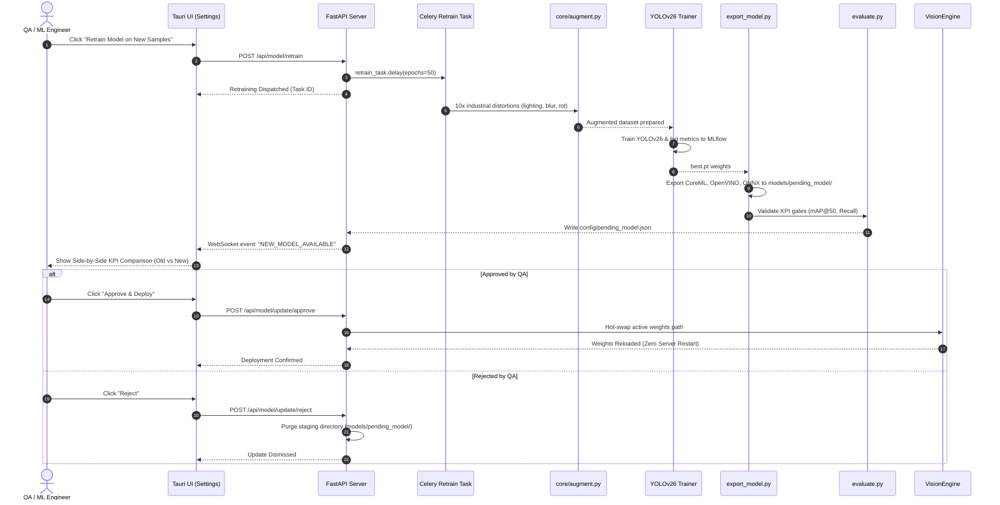
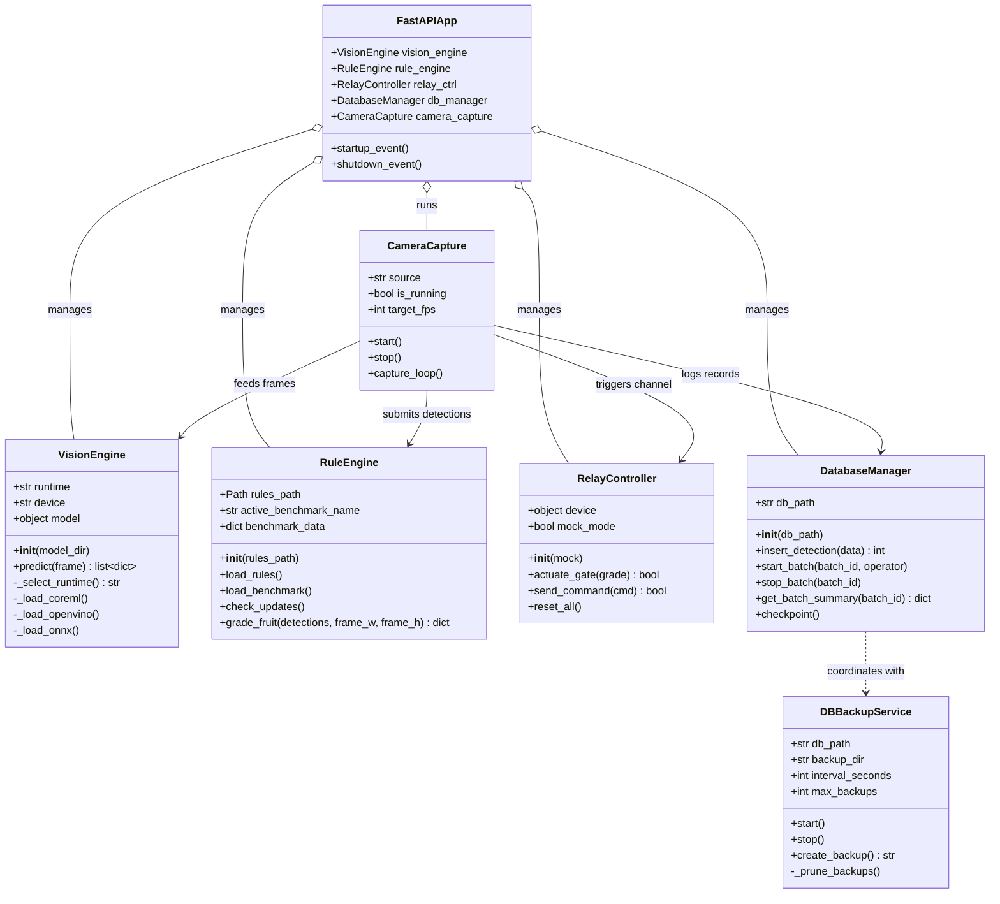
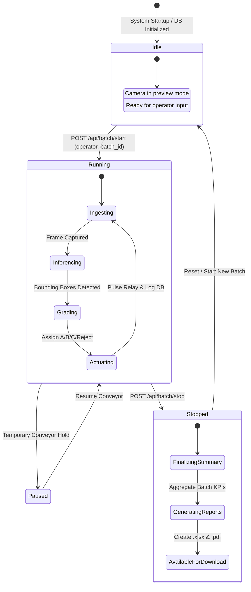
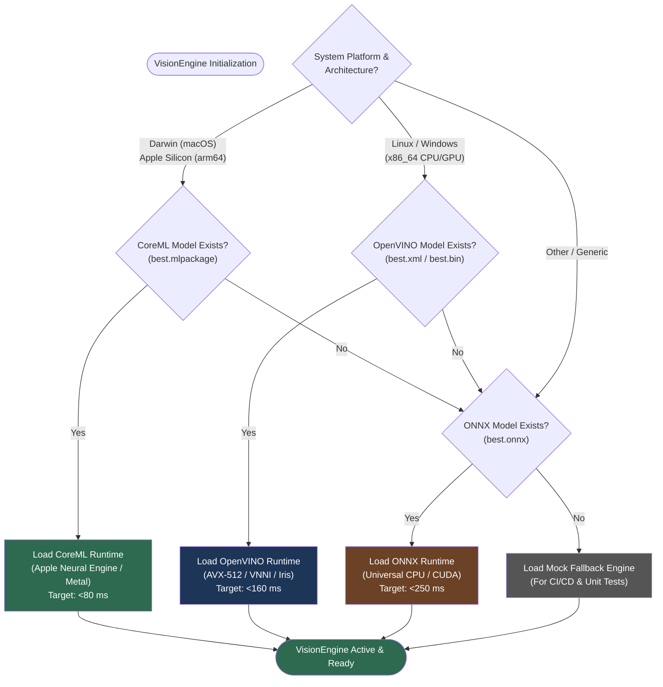

# Durian Classification System — Architecture & Workflow Diagrams

This directory contains clear, standard diagrams (User Flows, Sequence Diagrams, UML Diagrams, State Machines, and Flowcharts) to introduce the system workflows, user journeys, and component interactions.

---

## Table of Contents

1. [User Flow Diagram (Operator & Evaluator Journeys)](#1-user-flow-diagram)
2. [UML Use Case Diagram (Roles & Capabilities)](#2-uml-use-case-diagram)
3. [Real-Time Sorting Sequence Diagram](#3-sequence-diagram--real-time-fruit-sorting)
4. [OTA Model Retraining Sequence Diagram](#4-sequence-diagram--ota-model-retraining--approval)
5. [UML Class Diagram (Core Architecture)](#5-uml-class-diagram--core-engines)
6. [Batch Lifecycle State Machine Diagram](#6-batch-lifecycle-state-machine-diagram)
7. [Hardware-Adaptive Vision Engine Flowchart](#7-vision-engine-runtime-selection-flowchart)

---

## 1. User Flow Diagram

Visualizes the step-by-step path for both **Factory Operators** (Edge Mode) and **QA / Remote Evaluators** (Cloud/Workflow Mode).

```mermaid
flowchart TD
    Start(["User Opens System"])
    Mode{"Select Execution Mode"}

    Start --> Mode

    %% --- Factory Operator Journey ---
    subgraph EdgeJourney ["Edge Industrial Mode (main.py + Tauri)"]
        Launch1["Run: python main.py"]
        TauriUI["Open Tauri Desktop Application"]
        StartBatch["Start Batch Session\n(Enter Operator Name & Batch ID)"]
        LiveFeed["Monitor Live Stream\n(Base64 JPEG Annotations @ 10 FPS)"]
        GradeFruit["VisionEngine + RuleEngine\nAssign Grade: A / B / C / REJECT"]
        GateActuate["USB Relay Trigger\nPneumatic Gates (Ch 1-4) Actuate"]
        MoreCheck{"More Fruits on Conveyor?"}
        StopBatch["Stop Batch Session"]
        ExportReports["Export Batch Reports\n(.xlsx Excel & .pdf Certified)"]
        FinishEdge(["Batch Completed"])

        Launch1 --> TauriUI --> StartBatch --> LiveFeed --> GradeFruit --> GateActuate --> MoreCheck
        MoreCheck -- "Yes" --> LiveFeed
        MoreCheck -- "No" --> StopBatch --> ExportReports --> FinishEdge
    end

    %% --- QA & Remote Evaluator Journey ---
    subgraph CloudJourney ["Web and Cloud Mode (workflow_app/app.py)"]
        Launch2["Run: python workflow_app/app.py"]
        BrowserUI["Open Web Browser\n(http://127.0.0.1:8000 or Public Tunnel)"]
        UploadImages["Upload Durian Images / Datasets"]
        RunWorkflow["Execute Roboflow Cloud Workflow"]
        InspectResults["Inspect Detections, Defect Classes\n& Confidence Scores"]
        FinishCloud(["Inspection Finished"])

        Launch2 --> BrowserUI --> UploadImages --> RunWorkflow --> InspectResults --> FinishCloud
    end

    Mode -- "Edge Sorting Line" --> EdgeJourney
    Mode -- "QA / Remote Audit" --> CloudJourney
```

---

## 2. UML Use Case Diagram

Defines system actors and their interactions with system capabilities.

---

## 3. Sequence Diagram — Real-Time Fruit Sorting

Illustrates the millisecond-level interaction cycle from optical capture to pneumatic sorting gate actuation.

---

## 4. Sequence Diagram — OTA Model Retraining & Approval

Demonstrates zero-downtime model updates with human-in-the-loop KPI validation.

---

## 5. UML Class Diagram — Core Engines

Shows the structural relationships, fields, and public methods across backend modules.

---

## 6. Batch Lifecycle State Machine Diagram

Describes the internal state machine governing sorting batches, concurrency locks, and report generations.

---

## 7. Vision Engine Runtime Selection Flowchart

Explains how `VisionEngine` achieves hardware-adaptive zero-configuration execution across macOS, Intel/AMD x86, and universal devices.

